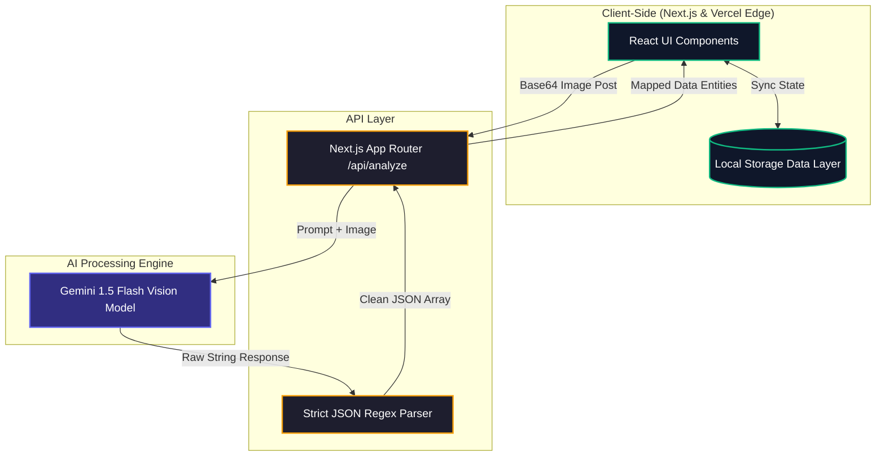

# EcoLens AI 🍃

EcoLens AI is a high-performance, intelligent product scanner that instantly evaluates the environmental and health impacts of everyday items. Our objective is to make sustainable shopping frictionless and data-driven for the everyday consumer. By simply snapping a photo of a product, packaging, or ingredients list, EcoLens AI utilizes advanced computer vision and Large Language Models to extract ingredients, flag toxic chemicals, and proactively suggest highly-rated, eco-friendly "Green Swaps."

**🌍 Live Demo:** [https://eco-lens-ai.vercel.app/](https://eco-lens-ai.vercel.app/)

## How It Works

By bridging the "information gap" at the critical moment of purchase, EcoLens AI provides a comprehensive **0-100 Eco-Score** and highlights hidden "Red Flag" chemicals (like Phthalates or PFAS) in seconds. This empowers users to confidently reject harmful products and pivot to actionable, sustainable alternatives.

### System Architecture

Our overarching architecture relies on a privacy-first, edge-ready approach. Historical "impact data" is calculated and stored entirely on the client-side, ensuring user privacy and zero database latency.



## Features

- **📸 Smart Product Scanner**: Upload or snap a photo of a product to instantly scan it.
- **⚡ AI-Powered Analysis**: Leverages Google Gemini Flash models for lightning-fast computer vision and JSON data extraction.
- **📊 Sustainability Scoring**: Calculates a customized Eco-Score (0-100) based on ingredients, packaging, and brand sustainability.
- **⚠️ Chemical Red Flags**: Highlights harmful ingredients like Phthalates or SLS present in the product.
- **🌱 Green Swaps**: Recommends eco-friendly, highly-rated alternative products with estimated price comparisons.
- **💾 Local Data Persistence**: Saves user scan history and calculates long-term environmental impact directly in the browser (no database overhead).

## Tech Stack

- **Framework**: Next.js 14 (App Router)
- **Styling**: Tailwind CSS & Lucide React
- **AI Integration**: `@google/generative-ai`
- **UI Architecture**: Shadcn UI / Vercel v0

## Getting Started

1. Set up your environment variables:
   Create a `.env.local` file in the root directory and add your Google Gemini API key:

```bash
GEMINI_API_KEY=your_api_key_here
```

2. Install dependencies:

```bash
npm install
```

3. Run the development server:

```bash
npm run dev
```

4. Open [http://localhost:3000](http://localhost:3000) with your browser to see the result.
